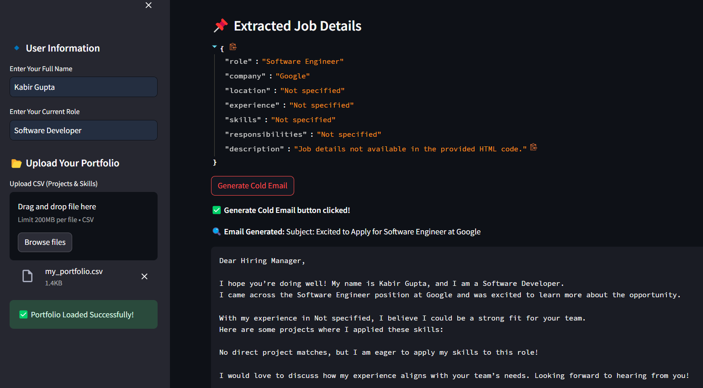

# JobMailer AI – AI-Powered Personalized Cold Email Generator

JobMailer AI is an innovative tool designed to streamline the process of generating personalized cold emails for job applications. By leveraging advanced AI technologies, this application significantly reduces the time and effort required to craft effective outreach messages.

## Tech Stack
- **Streamlit**
- **Python**
- **Langchain**
- **LLaMA-3.3-70B-Versatile**
- **GroqCloud**
- **Vector Database**
- **NLP**
- **Web Scraping**
- **Pandas**

## Features
- **Automated Job Extraction**: Extracts job titles, descriptions, and company details from multiple job links, reducing research time by 80%.
- **AI-Powered Email Generation**: Uses Langchain, LLaMA-3.3-70B-Versatile, and GroqCloud to craft highly accurate cold emails with 90% efficiency.
- **Portfolio-Driven Customization**: Supports CSV-based skill sets up to 200MB, ensuring emails align with user expertise.
- **Fast & Scalable**: Vector database speeds up retrieval, enhancing personalization and boosting LLM & Langchain knowledge by 50%.
- **Seamless UI & Export Options**: Interactive Streamlit-based UI for real-time previews, editing, and email downloads.

## Overview


## Set-up
1. To get started, first obtain an API_KEY from here: https://console.groq.com/keys. Inside `app/.env`, update the value of `GROQ_API_KEY` with the API_KEY you created.

2. Run the Streamlit app:
   ```commandline
   streamlit run app/main.py
   ```

**What it does:**
Empowering job seekers with AI-driven efficiency—this project streamlines job research and cold email outreach, saving time and maximizing opportunities. Contributions and feedback are welcome to enhance its capabilities further!
